# T3A2 - MERN Application

https://techmeet.netlify.app

Created by Wendy and Morgan

## R1 - Description

### R1.1 - Purpose

Existing event applications are highly saturated with an enormous variety of events. From hobby groups, to social meetups, all compete for space and attention on popular event platforms. In light of this, we see an opportunity to create an exclusive platform for professional development events catered to the local tech community.  

This application is dedicated to connecting professionals in the technology industry and designed to help them come together through meetups, workshops, conferences and other live events. 

### R1.2 - Functionality/Features

Users: registered users receive a personal profile and the ability to RSVP to events. 

Events: Organisers are free to create events and invite people to attend.  

Registration/RSVP: Users can register their intent to attend any public event or any private event for which they have an invitation. 

Attendees List: Event organisers can view a guestlist of people that have registered to attend their event.

Invites: Organisers are able to send invitations to both private and public events. 

Search: Users can search for upcoming events of interest, other users and organisers. 

Favourites: While browsing events, users have the ability to mark an event that they may interest in without having to commit to an RSVP. 
 
### R1.3 - Target Audience
Professionals and aspiring professionals from the tech industry

### R1.4 - Tech Stack

#### Client

- ReactJS: Frontend framework for building user interfaces.

- Bulma: CSS framework.

#### Server

- Node.js: JavaScript runtime environment.

- Express.js: Web application framework.

- MongoDB: NoSQL document-oriented database.

#### Utils

- AWS S3: Cloud storage.

#### Deployment

- Heroku: Cloud hosting platform.

#### DevOps

- Github Project: Kanban board and project management tool.

- Balsamiq: wireframing software. 

### Libraries

#### Client 

- axios: a promise based HTTP client for Node.js and browser. Applied in project to consume REST APIs for CRUD functions.
- bulma: a CSS framework based on Flexbox and built with Sass. Is reponsive and modular - provides styling for hero components, typography cards, buttons, navbar and footer.
- font-awesome: an icon library, used sparingly in this project
- react-datetime-picker: generates a calendar to select date and time, and submits as form-data
- react-spinners: a collection of load spinners, Ring Loader applied only

#### Server

- express: a Node webframework, employed in this project to handle requests with various HTTP verbs, and house request processing middleware.
- body-parser: a middleware module that extracts body data from an HTTP Post request, deployed to create entities and authentication within the project.
- cookie-parser: a middleware module that allows access to the header of a request or response. 
- cors: a Node package allowing web application permissions to access resources from one origin to another domain.
- dotenv: a Node package that allows access to an .env file and loads the content.
- passport: an Express-friendly, authentication middleware allowing for authentication with an email and password.

## R2 - Dataflow Diagram

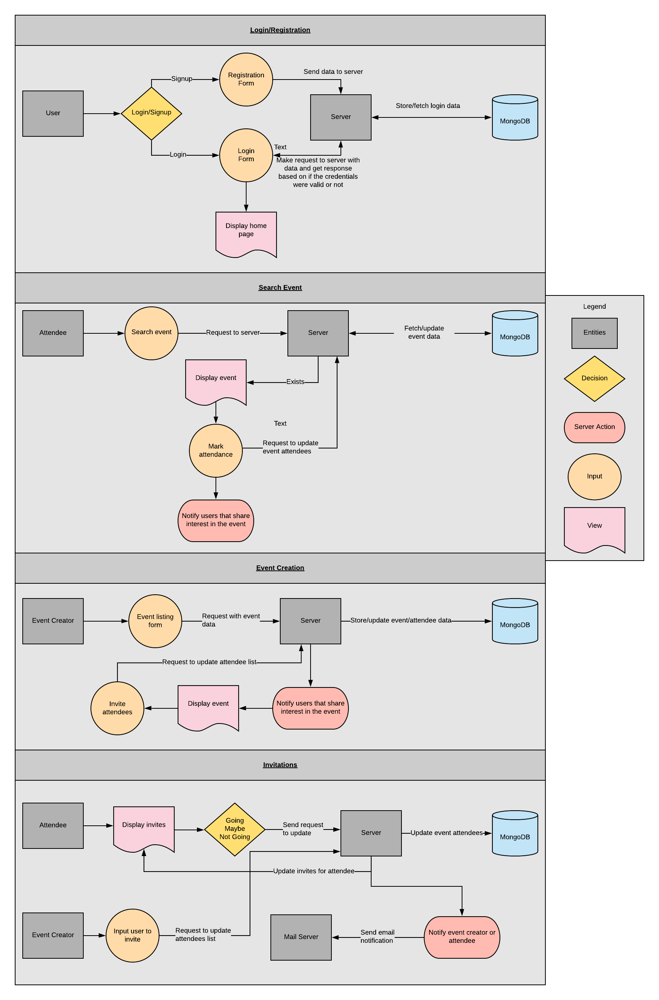

## R3 - Architecture Diagram

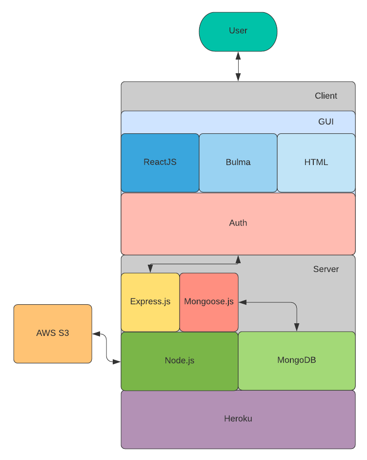

## R4 - User Stories

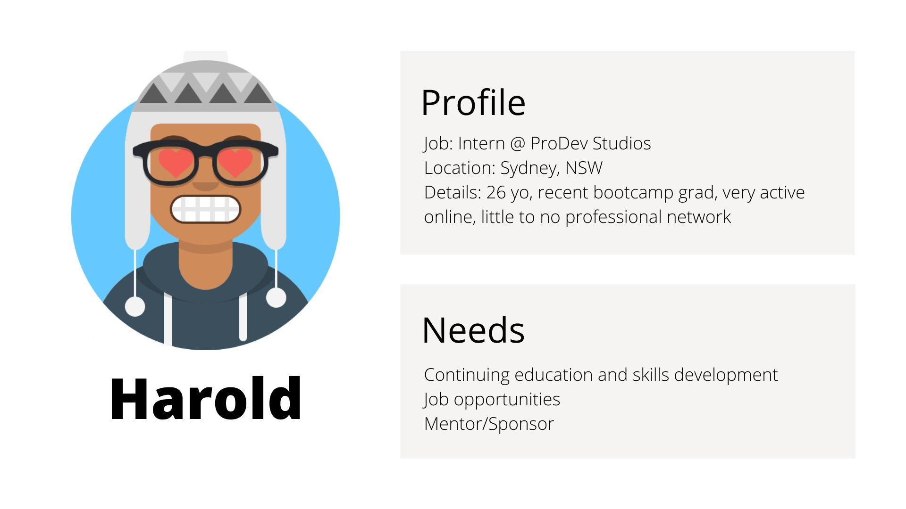

 More on Harold the Intern 

Harold is a recent graduate from a bootcamp course. In the last 6 months he had been diligently developing is coding skills but in doing so he had somewhat neglected career building activities. He has a network of peers but very few professional connections in the local tech community. Harold has a couple items on his portfolio but does not feel confident sending it to employers as of yet. He's concerned about his job prospects as well as leaving a highly supportive network. He's developed an affinity for Javascript and would like to become more proficient in React. Harold has also heard that having a mentor that can vouch for you can dramatically influence your career. 

 More on Cynthia the Software developer 

After completing her CS degree 9 years ago, Cynthia has worked in software development and is now looking for her vertical move. She's been keeping up to date with the latest frameworks and languages and becoming much more active online, trying to establish herself as an expert on NoSQL databases, such as a MongoDB. Presently, her professional network consists of mostly data analysts and data professionals - she would like to change that. Cynthia wants to engage with the growing tech community in her local area and participate in discussions. 

 More on Nathaniel the CTO 

Nathaniel was completing his CS degree as he co-founded his first startup - a logistics platform. He is now the CTO of Starlink and has been in the industry for 17 years. He's looking give back, and to cultivate the local eco-system and the next generation of tech professionals. He's well established as a thought leader but believes in the value of face to face interactions. Nathaniel is also on the look out for up and coming talent to recruit; he understands that good talent is hard to come by and a very rare commodity.  

#### From analysis of the three personas, we developed the following user stories:

 Visitor 

+ I want to be able to register a new account.
+ I want to browse events that might interest me.
+ I want to search for events that might be relevant to me.

 Registered User 

+ I want to be able to login to my existing account.
+ I want to be able to add my contact information on my profile.
+ I want to be able to list my interests on my profile.
+ I want to be able to list my hobbies on my profile.
+ I want to be able to list my professional skills on my profile.
+ I want to be able to browse the website on different devices.
+ I want to make changes to my account details and credentials.

    Attendee
    + I want to be able to mark if I am attending the meetup.
    + I want to get notified on cancelled meetups.
    + I want to display my attended meetups on my profile. meetup or not (Going, Maybe, Not Going).
    + I want change my attendence to a meetup.
    + I want to favourite or save an event for later.
    + I want to view and repond to all my invitations.

    Organiser
    + I want to be able to create a new meetup.
    + I want to be able to update an existing meetup that I created.
    + I want to be able to cancel an existing meetup that I created.
    + I want to review the guest list to my event.
    + I want to set the privacy status of my event.
    + I want to send invitations to my event.
    + I want to see a list of all my events. 

 Admin 

+ I want to be able to manage registered users.
+ I want to be able to manage and moderate meetup listings.

## R5 - Wireframes

 Desktop 

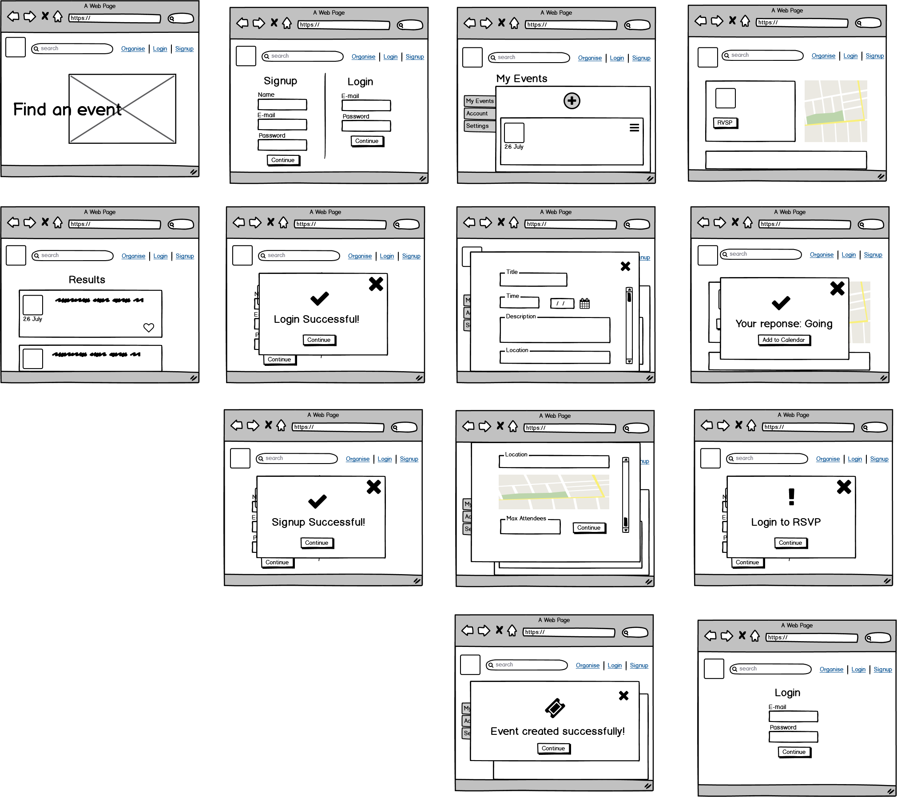

 Mobile 

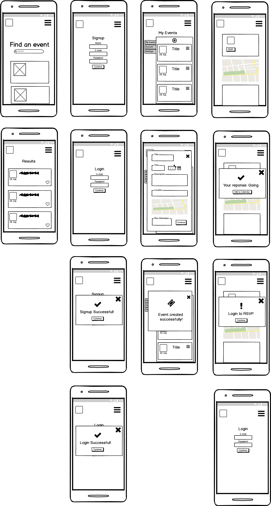

 Tablet 

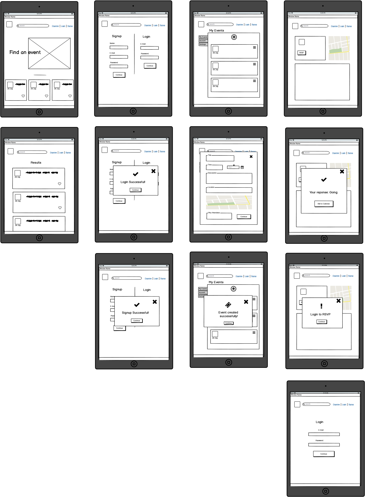

## R6 - Planning

### Kick-off
After receiving the go-ahead, we started mapping out day one. We prioritised the GitHub repository setup and choosing the project management tool. We ended up with one repository for both the frontend and the backend of the application and for the project management tool will be using the projects feature available on GitHub. 

### Project management methodology
On this project, we elected to use an Agile hybrid Kanban and Scrum approach. From Scrum, we borrowed daily sprint standups, sprint planning, and the sprint roles (discussed below). And from Kanban, we apply the practice of a visualised workflow, breaking down the project requirements into cards with subtasks. Being relatively flexible with the method prescription is another hallmark of Kanban. We work within a such structure that encourages self-organisation, independence; we integrate collaboration and consultation  where essential.

#### During Implementation
For implementation, continued with our strategy and applied a hybrid approach to the project. The client components and server components were developed relatively independently for the first week, with rapid prototyping techniques. The components reside within the same repository, so we employed a simple branching strategy to start - one for the clientside and one for the serverside - then with implementations, we added feature branches. Pull requests had to be raised and confirmed with the other team member before approval to merge to master. Merge conflicts were easily resolved with an ad-hoc consultation. The following week was reserved for bug triage, styling and deployment. Each component was tracked on the project Kanban that is linked to the repository.  

### Delegation
We gravitated to very loose approach to delegation; as a team of two, we decided which task to accept and confirmed with eachother. The tasks are ranked by complexity, priority and if there were any dependencies. Each task had an 'owner'; reminiscent of the product owner role in a sprint. The task owner is also the 'development team' (it's just one of us), creating the first draft or iteration. The draft or iteration is reviewed by  prior to addition to the master.

#### During Implementation
The project was split into client and server side; Morgan was assigned the server component and Wendy was assigned the client component. Both components were broken down into an MVC pattern to develop the MVP and consequently into sub tasks. Like the previous part of the project, each component was treated as a 'mini-project' and each team member 'owned' their respective components, being ultimately responsible for it's delivery.  

### Project Planning 

 Day 1

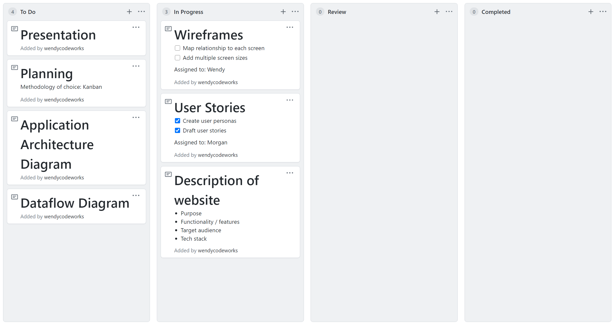

 Day 2

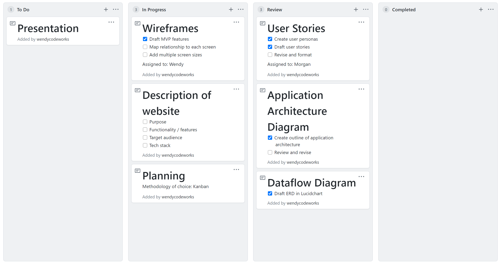

 Day 3

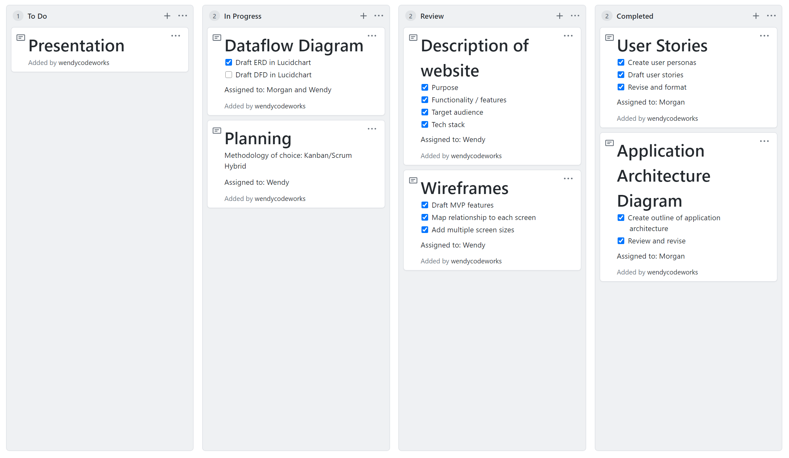

 Day 4

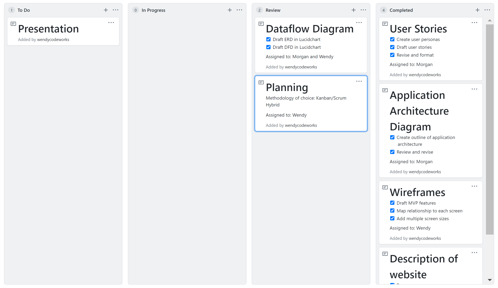

 Day 5

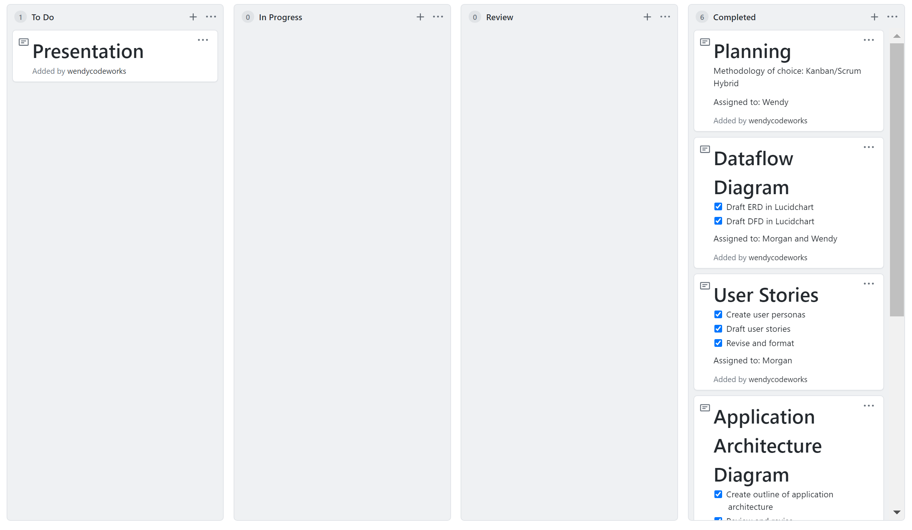

### Project Implementation

 Week 1

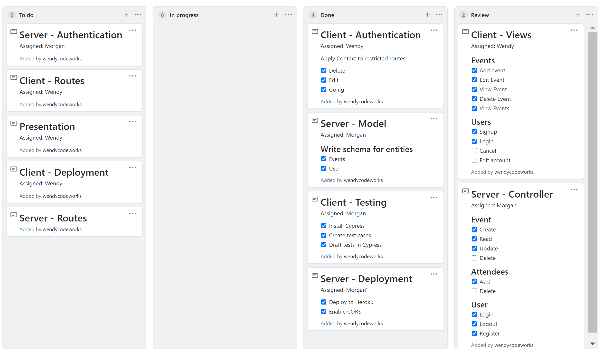

 Week 2 - Day 1

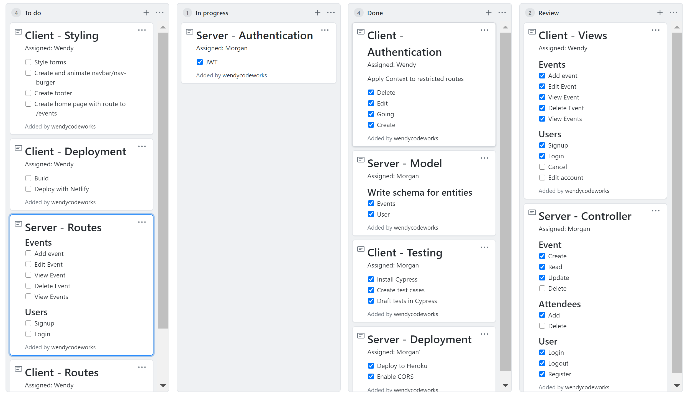

 Week 2 - Day 2

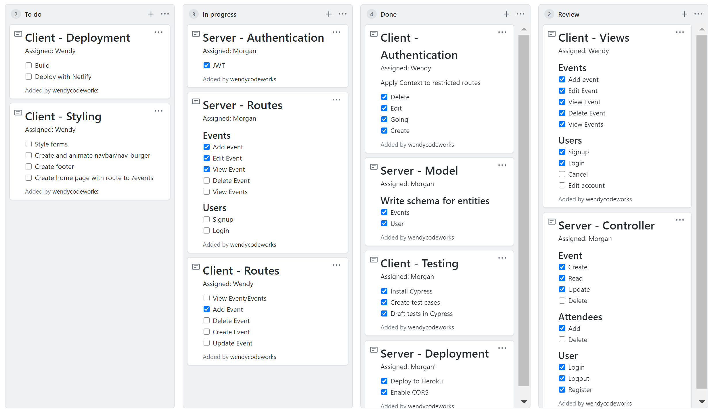

 Week 2 - Day 3

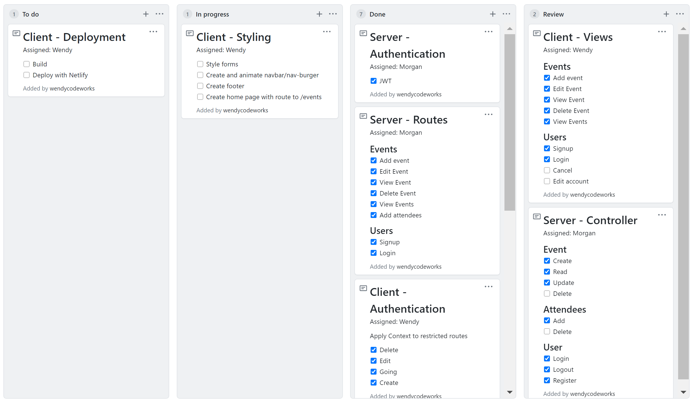

 Week 2 - Day 4

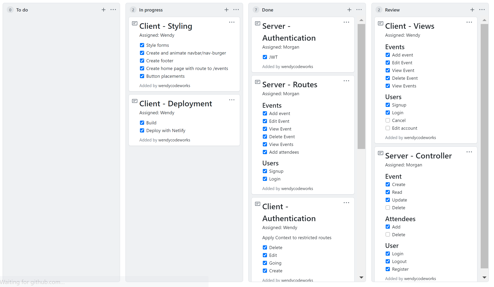

