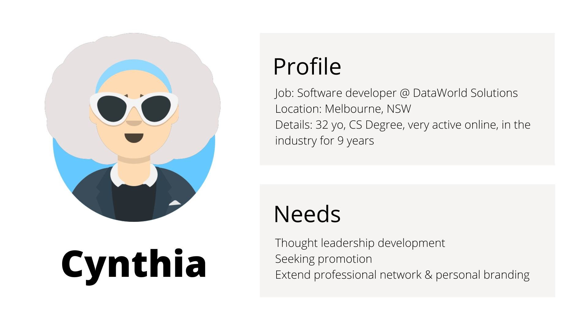
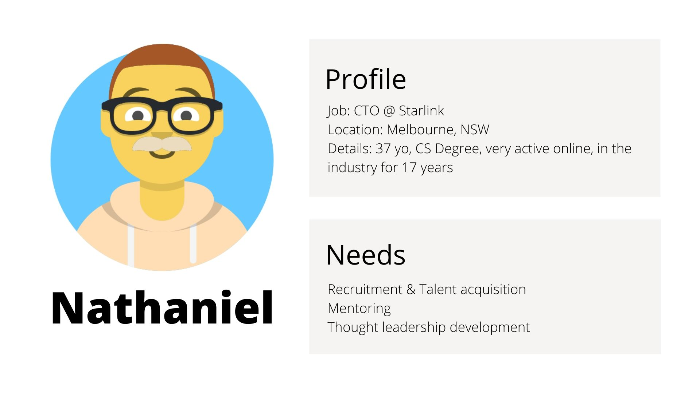

# T3A2 - MERN Application
Created by Wendy and Morgan

[TOC]

## R1 - Description

### R1.1 - Purpose

This application is dedicated to  professionals in the technology industry and designed to help them connect through meetups, workshops, conferences and other live events. 

### R1.2 - Functionality/Features

Users

Events

Registration/RSVP

Guest List

Search

### R1.3 - Target Audience
Professionals and aspiring professionals from the tech industry

### R1.4 - Tech Stack

#### Frontend

- ReactJS: Frontend framework for building user interfaces.

- Bulma: CSS framework.

#### Backend

- Node.js: JavaScript runtime environment.

- Express.js: Web application framework.

- MongoDB: NoSQL document-oriented database.

#### Utils

- AWS S3: Cloud storage.

#### Deployment

- Heroku: Cloud hosting platform.

## R2 - Dataflow Diagram

## R3 - Architecture Diagram

## R4 - User Stories

Harold - User Stories

+ As a user, I want to be able to register a new account.
    + As a registered user, I want to be able to list my interests on my profile.

As a user, I want to be able to register a new account.

As a registered user, I want to be able to login to my existing account.

As a registered user, I want to be able to add my contact information on my profile.

As a registered user, I want to be able to list my interests on my profile.

As a registered user, I want to be able to list my hobbies on my profile.

As a registered user, I want to be able to list my professional skills on my profile.

As a registered user, I want to display my attended meetups on my profile.

As a registered user, I want to be able to browse the website on different devices.

As a registered user, I want to be able to create a new meetup.

As a registered user, I want to be able to update an existing meetup that I created.

As a registered user, I want to be able to cancel an existing meetup that I created.

As a registered user, I want to get notified on cancelled meetups.

As a registered user, I want to be able to mark if I am attending the meetup or not (Going, Maybe, Not Going).

As an administrator, I want to be able to manage registered users.

As an administrator, I want to be able to manage meetup listings.

## R5 - Wireframes

## R6 - Planning

### Kick-off
After receiving the go-ahead, we started mapping out day one. We started by setting up the GitHub repository and choosing the project management tool. We ended up with one repository for both the frontend and the backend of the application and for the project management tool will be using the projects feature available on GitHub. 

### Project management methodology
We elected to use a hybrid Kanban and Agile approach to this project. The tasks are ranked by complexity, priority and if there were any dependencies. 
