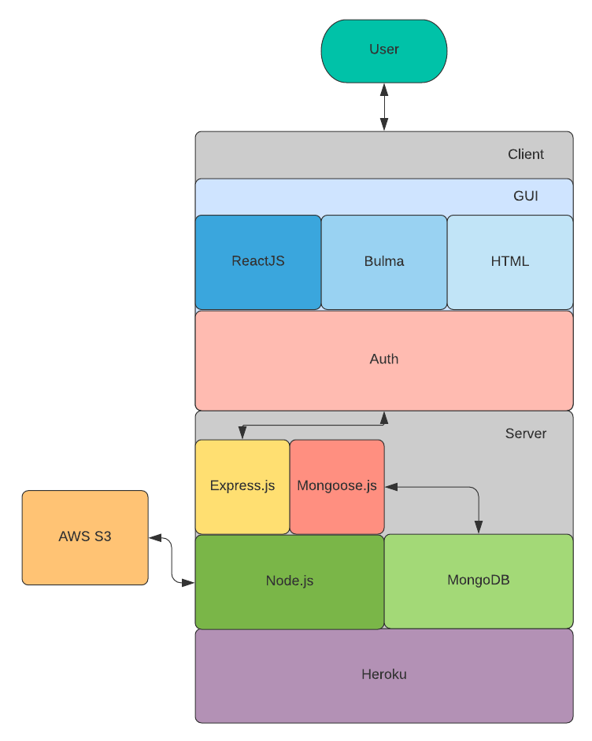

# T3A2 - MERN Application
Created by Wendy and Morgan

[TOC]

## R1 - Description

### R1.1 - Purpose

Existing event applications are highly saturated with an enormous variety of events. From hobby groups, to social meetups, all compete for space and attention on popular event platforms. In light of this, we see an opportunity to create an exclusive platform for professional development events catered to the local tech community.  

This application is dedicated to connecting professionals in the technology industry and designed to help them come together through meetups, workshops, conferences and other live events. 

### R1.2 - Functionality/Features

Users: registered users receive a personal profile and the ability to RSVP to events. 

Events: Organisers are free to create events and invite people to attend.  

Registration/RSVP: Users can register their intent to attend any public event or any private event for which they have an invitation. 

Attendees List: Event organisers can view a guestlist of people that have registered to attend their event.

Invites: Organisers are able to send invitations to both private and public events. 

Search: Users can search for upcoming events of interest, other users and organisers. 

Favourites: While browsing events, users have the ability to mark an event that they may interest in without having to commit to an RSVP. 
 
### R1.3 - Target Audience
Professionals and aspiring professionals from the tech industry

### R1.4 - Tech Stack

#### Frontend

- ReactJS: Frontend framework for building user interfaces.

- Bulma: CSS framework.

#### Backend

- Node.js: JavaScript runtime environment.

- Express.js: Web application framework.

- MongoDB: NoSQL document-oriented database.

#### Utils

- AWS S3: Cloud storage.

#### Deployment

- Heroku: Cloud hosting platform.

## R2 - Dataflow Diagram

## R3 - Architecture Diagram

## R4 - User Stories

 More on Harold the Intern 

 More on Cynthia the Software developer 

 More on Nathaniel the CTO 

#### From analysis of the three personas, we developed the following user stories:

 Visitor 

+ I want to be able to register a new account.
+ I want to browse events that might interest me.
+ I want to search for events that might be relevant to me.

 Registered User 

+ I want to be able to login to my existing account.
+ I want to be able to add my contact information on my profile.
+ I want to be able to list my interests on my profile.
+ I want to be able to list my hobbies on my profile.
+ I want to be able to list my professional skills on my profile.
+ I want to be able to browse the website on different devices.

+ Attendee
    + I want to get notified on cancelled meetups.
    + I want to be able to mark if I am attending the
    + I want to display my attended meetups on my profile. meetup or not (Going, Maybe, Not Going).
    + I want change my attendence to a meetup.
    + I want to favourite or save an event for later.

+ Organiser
    + I want to be able to create a new meetup.
    + I want to be able to update an existing meetup that I created.
    + I want to be able to cancel an existing meetup that I created.
    + I want to review the guest list to my event.
    + I want to set the privacy status of my event.
    + I want to send invites to my event.

 Admin 

+ I want to be able to manage registered users.
+ I want to be able to manage meetup listings.

## R5 - Wireframes

### Desktop

### Mobile

### Tablet

## R6 - Planning

### Kick-off
After receiving the go-ahead, we started mapping out day one. We prioritised the GitHub repository setup and choosing the project management tool. We ended up with one repository for both the frontend and the backend of the application and for the project management tool will be using the projects feature available on GitHub. 

### Project management methodology
On this project, we elected to use an Agile hybrid Kanban and Scrum approach. From Scrum, we borrowed daily sprint standups, sprint planning, and the sprint roles (discussed below). And from Kanban, we apply the practice of a visualised workflow, breaking down the project requirements into cards with subtasks. Being relatively flexible with the method prescription is another hallmark of Kanban. We work within a such structure that encourages self-organisation, independence; we integrate collaboration and consultation  where essential.

### Delegation
We gravitated to very loose approach to delegation; as a team of two, we decided which task to accept and confirmed with eachother. The tasks are ranked by complexity, priority and if there were any dependencies. Each task had an 'owner'; reminiscent of the product owner role in a sprint. The task owner is also the 'development team' (it's just one of us), creating the first draft or iteration. The draft or iteration is reviewed by  prior to addition to the master.

### Project progression
